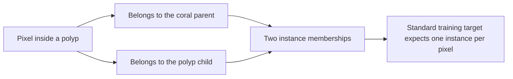
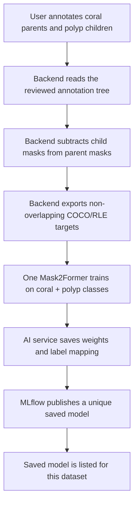
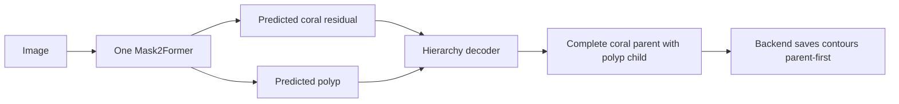
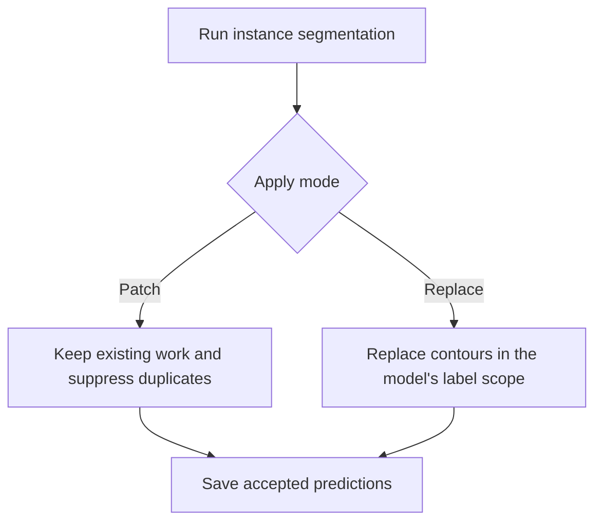
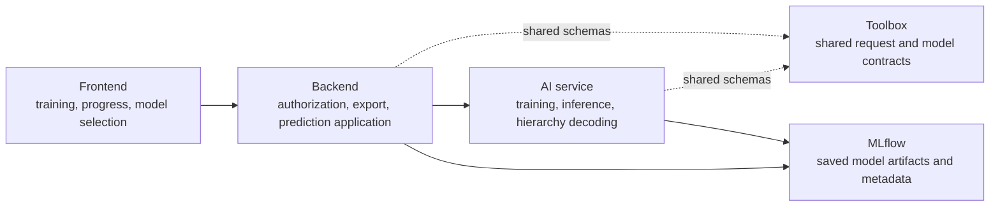

# Hierarchy-Aware Instance Segmentation

## The short version

We use **one Mask2Former model**, not one model for coral and another model for polyps.

The model predicts every selected label, such as:

- coral
- polyp
- any other label selected for that training run

The special part is not a new neural-network architecture. The special part is how we prepare overlapping parent/child annotations for training and how we rebuild their relationship after prediction.

Our implementation chose the second option from the original PR review:

> Cut the children out of the parent before training, then merge them back into the parent after prediction.

We call this format `exclusive_hierarchy_v1`.

## Preservation checkpoint — 2026-08-11

The PR was intentionally paused, but the implementation and its related
dependency state were saved to the personal fork branches. These are
checkpoint commits, not upstream-rebased PR revisions:

| Repository | Branch | Latest commit |
| --- | --- | --- |
| `ai-service` | `feat/hierarchy-aware-instance-training-ai` | `237bea7` |
| `backend` | `feat/hierarchy-aware-instance-training-backend` | `b159ea2` |
| `frontend-react` | `feat/hierarchy-aware-instance-training-frontend` | `a6f2fe9` |
| `iquana-toolbox` | `feat/hierarchy-aware-instance-training-contract` | `c2be767` |
| `iquana-service-core` | `checkpoint/instance-segmentation-2026-07-31` | `6866915` |

The implementation-plan files are preserved in the workspace and copied into
`ai-service/docs/hierarchy-instance-segmentation/`. Generated/runtime files
were deliberately excluded: MLflow/app databases, `backend/mlruns/`, Python
bytecode, and `frontend-react/src/setupProxy.js`.

Checkpoint verification passed for the toolbox focused tests and frontend
tests/build. AI-service tests were blocked by unavailable dev dependencies and
network DNS failure; the backend focused run hung and was stopped. The next
step, when PR work resumes, is to fetch official remotes and rebase in
dependency order rather than treating these checkpoints as PR-ready.

## Why normal instance segmentation has a problem

Imagine that one coral contains several polyps.

- The coral mask covers the whole coral.
- Each polyp mask covers a smaller area inside that coral.
- A pixel inside a polyp therefore belongs to both the coral and the polyp.

That is natural for our annotations, but a standard instance-segmentation training map normally gives each pixel only one instance ID.



This is the original feature requirement: preserve the useful coral → polyp relationship without giving Mask2Former an invalid overlapping target map.

## The two approaches considered

### Option 1: one model per hierarchy depth

For example:

- Model A predicts level 1 objects such as corals.
- Model B predicts level 2 objects such as polyps.

This is conceptually simple, but it means training, saving, loading, selecting, and running several models for one annotation action.

We did **not** implement this option.

### Option 2: one model with non-overlapping training targets

We use one Mask2Former with one output class for coral and another output class for polyp.

Before training:

1. Start with the complete coral parent mask.
2. Find its child polyp masks.
3. Remove the polyp pixels from the coral training mask.
4. Keep each polyp as its own training instance.

The resulting training masks do not overlap, so every pixel has at most one instance ID.

```text
Original annotation                 Training representation

  +----------------+                  +----------------+
  |     CORAL      |                  | CORAL RESIDUAL |
  |   +--------+   |                  |   +--------+   |
  |   | POLYP  |   |       ->         |   | POLYP  |   |
  |   +--------+   |                  |   +--------+   |
  +----------------+                  +----------------+

The original coral includes             The coral target has a hole where
the polyp area.                          the polyp owns those pixels.
```

This is the approach we implemented.

## What happens when we train



The saved model contains enough information to understand its output:

- the dataset it belongs to;
- the database label IDs it predicts;
- the mapping from model classes to database labels;
- whether it is `flat` or `hierarchical`;
- the target encoding, such as `exclusive_hierarchy_v1`;
- the exact base-model version used for training;
- its unique registry key and active model version.

For the coral example, the mapping is:

```text
Model class 0 -> database label 3 -> coral
Model class 1 -> database label 4 -> polyp
```

## What happens during inference

The model first predicts ordinary, non-overlapping instances. It does not directly produce a database tree.

For a hierarchical saved model, the decoder then:

1. Reads the saved label hierarchy, for example `polyp -> coral`.
2. Looks for a predicted coral residual that geometrically contains a predicted polyp.
3. Attaches that polyp prediction to the coral prediction.
4. Adds the child's pixels back to the coral mask.
5. Returns a coral contour with polyp children so the backend can save the tree.



Important limitation: the decoder can connect and rebuild predictions, but it cannot invent a missing coral prediction. If the model predicts only polyps, they remain unparented.

## Flat versus hierarchical models

We still use the same Mask2Former architecture in both cases.

### Flat model

Use this when the selected labels do not have parent/child relationships.

Example:

```text
fish, boat, rock
```

Metadata:

```text
segmentation_mode = flat
target_encoding = standard
```

### Hierarchical model

Use this when at least one selected label has a parent or child relationship.

Example:

```text
coral
└── polyp
```

Metadata:

```text
segmentation_mode = hierarchical
target_encoding = exclusive_hierarchy_v1
```

The metadata says how the model was trained and how its predictions must be decoded. It does not select a different neural-network family.

## Why the first saved models predicted only polyps

The hierarchy architecture was not the cause of the final observed failure.

The two failed saved models used:

```text
epochs = 5
learning rate = 0.0001
training images = 1
effective optimizer updates = 5
```

They stopped with high losses of approximately `59.87` and `51.11`. Their output collapsed to the polyp class.

The later model used 18 epochs and reached approximately `36.94`. It successfully predicted both coral and polyp on the same image. This proves that:

- the saved model was loaded correctly;
- the class mapping was correct;
- the one-model hierarchy approach can produce both labels;
- the earlier five-update models were simply not trained enough.

We therefore do **not** need to add a minimum-image rule, mandatory validation split, special hierarchy neural network, or multiple depth-specific models for this PR.

## Patch and Replace modes

The original implementation always replaced annotations. We now provide two behaviors.

### Patch

- Keep existing contours.
- Compare new predictions with existing contours of the same label.
- Suppress a new prediction when its overlap is above the duplicate threshold.
- Add the remaining predictions.

This is useful when the model predicts only part of the annotation scope or the user already has manual work.

### Replace

- Delete existing contours only for labels declared by the selected model.
- Preserve unrelated labels where possible.
- Insert the new predictions.

This is useful when the selected model is expected to regenerate its full declared label scope.



## Saved custom models

Previously, training could overwrite or blur the identity of the base `mask2former` model. Now every successful run receives a unique key such as:

```text
mask2former-ds2-4917898f-ce55-434f-8e0c-be915d41ee48
```

The trained version receives the `active` alias. The annotation page loads that exact custom model when selected. Training another model does not erase the previous custom model.

Only trained models compatible with the active dataset should appear in that dataset's instance-segmentation selector. Base training templates remain in the training catalog.

## Which repository does what?



## Current intended PR size

These numbers describe the current local feature diff, including committed feature work and current uncommitted fixes. The comparison bases are the local upstream merge bases (`upstream/dev` for backend/frontend, `upstream/main` for AI/service-core, and `origin/main` for toolbox).

Generated and protected local files are excluded from the historical snapshot:

- `backend/mlruns/`
- `ai-service/mlflow.db`
- `backend/app.db`
- Python `__pycache__` files
- `frontend-react/src/setupProxy.js`

The line counts below are a historical local-diff estimate, not the final PR
size. After the checkpoint, use each repository's pushed branch and its
official target base to calculate the rebased PR diff.

| Repository | Files | Added lines | Removed lines |
|---|---:|---:|---:|
| Backend | 16 | 4,466 | 214 |
| AI service | 18 | 4,105 | 87 |
| Frontend | 21 | 1,802 | 222 |
| Iquana toolbox | 10 | 1,186 | 252 |
| Iquana service core | 2 | 1,351 | 773 |
| **Total** | **67** | **12,910** | **1,548** |

The total is inflated by tests and regenerated dependency locks:

| Kind of change | Files | Added lines | Removed lines |
|---|---:|---:|---:|
| Production source code | 38 | 7,114 | 516 |
| Tests | 23 | 4,420 | 225 |
| Dependency declarations and lockfiles | 6 | 1,376 | 807 |

If every test-file change were removed from the PR, the snapshot would be:

| Scope | Files | Added lines | Removed lines |
|---|---:|---:|---:|
| Implementation plus dependencies/locks, no tests | 44 | 8,490 | 1,323 |
| Production source only, no tests or dependency files | 38 | 7,114 | 516 |

Removing tests makes the PR shorter, but it does not make the implementation small. The largest source additions are the durable training-job state machine and the backend hierarchy export service. The tests are mostly protecting those exact state and hierarchy transitions; deleting them would make review and future refactoring riskier.

The practical way to reduce PR size is scope reduction, not test deletion:

- Keep hierarchy target export, model mapping/decoding, saved-model publication/discovery, dataset authorization, and Patch/Replace behavior in this feature.
- Keep one focused regression test for each of those contracts.
- Move optional lifecycle hardening, broad fault-injection matrices, legacy-history compatibility, and operational cleanup into follow-up PRs if the maintainers do not want them here.
- Do not remove tests for behavior that remains in the code. Either keep the test with the behavior or remove the behavior as a deliberate scope decision.

This is a large cross-repository feature. The biggest files are the durable training-job state store, hierarchy export service, and their tests. Before opening PRs, each repository should be reviewed independently so unrelated lifecycle hardening can be deferred if it is not necessary for the original requirement.

The final GitHub PR statistics may change after rebasing, splitting repositories into separate PRs, or regenerating lockfiles.

## Original PR review comment — completion checklist

### Major issues

| Original concern | Status | What we have now |
|---|---|---|
| Standard instance segmentation cannot train overlapping parent and child masks | **Fixed** | `exclusive_hierarchy_v1` subtracts children from parents for training and reconstructs the hierarchy after inference. |
| Consider one model per label depth | **Not chosen** | We chose the other proposed solution: one multiclass model with non-overlapping targets. |
| Models must say whether they are flat or hierarchical | **Fixed** | Saved metadata includes `segmentation_mode` and `target_encoding`. |
| Training silently fails or remains stuck in `starting` | **Fixed for the requested UX** | Jobs are stored durably in Redis before dispatch. Status, errors, cancellation, refresh recovery, and a 15-minute queued-start deadline exist. After one minute, the UI says that the queue is taking longer than usual and offers a cancel action. Timeout reconciliation currently occurs when status/history is read rather than through a background reaper. |
| Add Patch and Override modes | **Fixed** | The UI/backend support `patch` and `replace`. Patch suppresses same-label duplicates by IoU, but preserves a novel predicted child by attaching it to the matching existing parent; Replace clears only the model's declared label scope. |

### Minor issues

| Original concern | Status | What we have now |
|---|---|---|
| Do not show fake/default configuration while metadata is loading | **Fixed** | `ModelMetadataGate` shows a spinner and withholds model-dependent controls until metadata is available. |
| A starting run disappears after refresh | **Fixed** | Active jobs are stored in Redis and the frontend reloads durable dataset-scoped run history. |
| Show “taking longer than usual,” then time out and cancel | **Fixed for the requested UX** | Starting shows “Waiting for worker…”, changes to a clear long-wait warning after one minute, and offers “Cancel queued training.” The backend marks an unclaimed queued job `TIMED_OUT` after 15 minutes when reconciled. |

## Have we fixed everything from the comment?

We fixed the **core feature requirement**:

- one hierarchy-aware multiclass model can train coral and polyp together;
- overlapping annotations are converted into valid non-overlapping targets;
- predictions are reconstructed into parent/child contours;
- models identify themselves as flat or hierarchical;
- trained models are saved and selectable;
- Patch and Replace are available;
- starting jobs survive refresh and eventually time out.

The two previously open focused items are now closed and covered by focused tests:

1. A queued run warns after one minute and exposes a cancellation action before the worker starts.
2. Patch mode preserves a novel child below a duplicate predicted parent by attaching it to the existing matching parent.

The remaining background-reaper detail is operational hardening, not a missing behavior from the original comment. It does not require reopening the working training, publication, catalog, or hierarchy contracts.
